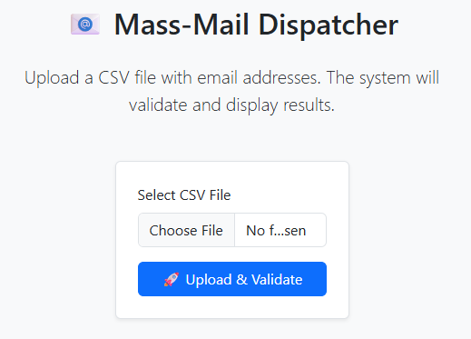
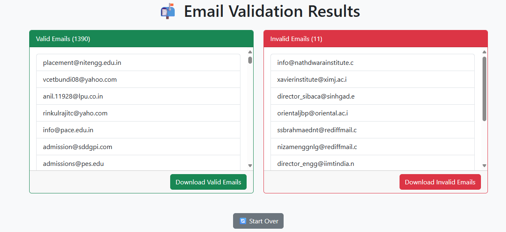

# 📧 Mass Mail Dispatcher (Flask Web Application)

This is a web-based application that allows users to upload a CSV file containing email addresses. The app validates each email and separates them into valid and invalid lists, which can be downloaded easily.

---

## 🚀 Features

- Upload CSV file containing email addresses
- Automatically detects and validates emails
- Separates emails into valid and invalid lists
- Provides downloadable `.txt` files for both lists
- User-friendly web interface built with HTML/CSS
- Real-time validation and error messages

---

## 📁 Project Structure

mass-mail-dispatcher/
│
├── app1.py # Flask backend
├── BULKEMAIL.csv # Sample input CSV
├── templates/
│ ├── index.html # Home upload page
│ └── result.html # Results display page
├── static/
│ └── style.css # Styling for the app
└── README.md # Project documentation

yaml
Copy
Edit

---

## 🛠 Technologies Used

- Python 3.x
- Flask
- HTML/CSS (Jinja templates)
- Pandas
- validate-email-address

---

## 🔧 Setup Instructions

### 1. Clone the Repository

```bash
git clone https://github.com/karthikeya1256/mass-mail-dispatcher.git
cd mass-mail-dispatcher

## 📸 Screenshots

### 🔹 Home Page (CSV Upload)


### 🔹 Result Page (Valid/Invalid Emails)

